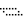
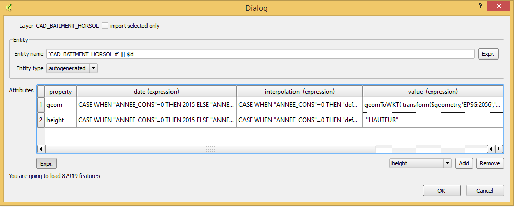

# TimeMachineGlobal Plugin

This is a QGIS plugin to display and edit the Global Atlas database.

It ships a QGIS project which must be used to use the plugin.

[See the screencast for a small preview](https://youtu.be/U57-ktb1xxk).

---------

## Principles

Every object appearing in TimeMachineGlobal is an *entity*. An *entity* is nothing more than an absolute reference of an object such as a building, a person, a city, etc.

The *entity* has *properties*. A *property* is nothing more than a certain value for a certain aspect (like it's name, it's shape, it's main construction material...) of an entity at a given date.

Let's say we have an entitiy called Entity_1 representing the City of Istanbul.

The following properties represent the name of the city evolving over time :

| entity   | property  | date  | value          |
| ---------|-----------|-------|----------------|
| Entity_1 | name      | -630  | Byzantium      |
| Entity_1 | name      | 330   | Constantinople |
| Entity_1 | name      | 1930  | Istanbul       |

The following properties model the population :

| entity   | property   | date | value      |
| ---------|------------|------|------------|
| Entity_1 | population | 1550 | 700'000    |
| Entity_1 | population | 1950 | 1'000'000  |
| Entity_1 | population | 2014 | 14'377'019 |

The evolving boundaries of the city can be modeled exactly in the same way :

| entity   | property | date | value          |
| ---------|----------|------|----------------|
| Entity_1 | geom     | -630 | [POLYGON_A][1] |
| Entity_1 | geom     | 1800 | [POLYGON_B][1] |
| Entity_1 | geom     | 2014 | [POLYGON_C][1] |

[1]: http://en.wikipedia.org/wiki/Well-known_text  "Description of WKT format"

Note that each property is completely independant of the others. 


### Interpolation

The previous section showed how to define values for different properties of an entity at *specific points in time*. To be able to display a state of the entity at any give date, we need to *interpolate* these values.

Behind the scene, a validity range will be created for each property. By default, as a best guess, a property will be valid from the date at the mid point between the previous property and the current property to the date at the mid point between the current property and the next property.

In the example of the name of Istanbul, this is what we would get :

| date  | value          | valid_from* | valid_to*   |
|-------|----------------|-------------|-------------|
| -630  | Byzantium      | infinity    | -150        |
| 330   | Constantinople | -150        | 1130        |
| 1930  | Istanbul       | 1130        | infinity    |

In this praticular case, the validity dates are wrong, because the dates of the properties are not just random dates, but they correspond to events where the names changed. To fix this, we can set the interpolation to *start* instead of *default* :

| date  | value          | interpolation | valid_from* | valid_to*   |
|-------|----------------|---------------|-------------|-------------|
| -630  | Byzantium      | start         | -630        | 330         |
| 330   | Constantinople | start         | 330         | 1930        |
| 1930  | Istanbul       | start         | 1930        | infinity    |

This fixes the validity range. It is also possible to set the interpolation to *end*, which works the opposite way.

Currently, the Global Atlas is not capable of doing continuous interpolation. This means that in the example about Istanbul's population, if we wanted to display the population in year 1617, the Global Atlas would not be able to display a value in between 700'000 and 1'000'000. It would have to display one of the two values, according to the validity range as explained above.

### Sources and adding more and more details

Each property has a link to a source where the value of the property comes from. Adding more values for properties at different point in history refine progressively the entity's representation.

It is also possible that a source defines the absence of a property. For instance, if a map shows that one city does not exist at a certain date, it can define an empty value (NULL) for the geometry of that entity.

### Succession

As we saw earlier, the validity range of a property is defined using the previous and next properties of the same entity. But it can happen that the validity range depends on another entity, because that other entity succeeds to the first entity. 

A typical example is a building that was destroyed to be replaced by another building. To achieve this, it is necessary to define a *succession relationship* between the two entities.


---------

## Getting started

Click on the "open" button  to load the QGIS project.

You're now seeing the TimeMachineGlobal map. You can browse through time using the slider of the main dock window.

### The layers

- **properties_for_qgis (unfiltered)** : This table contains all *properties* of the database. 
- **properties_for_qgis (points/lines/polygons)** : These layers are live extracts of the property table (because of the way QGIS works, to be displayed on the map, each geometry type must be represented on a different layer). Using normal QGIS tools, it is possible to edit the geometries.
- **entities** : This table lists all *entities*. It can be used to edit the name or the type of entities.
- **entity_type** : This table lists all possible entity type. It is possible to add custom types, but style for new entity types must be created manually.
- **property_type**: This table list all available properties types. It is possible to add custom properties, but the first four must be kept as they are needed by the system.
- **source**: This table lists all *sources* from where properties are known.
- **Source (group)**: Each subgroup in this group must be named with an integer representing a year. Reference layers can then be placed into these groups, allowing for easy navigation in time using  and , the reference layers being automatically shown or hidden.
- **CartDB Light**: This is just a background layer.


---------

## Reference - The Toolbar

### Help button  

Shows this help.

### Open button 

Loads the provided QGIS file. You must start with this file to work with the plugin, because it makes use of the file's layer IDs. This means you can save your file as another name if you want to add your own layers.

### Config button 

(Will be removed) For developpement purposes. Allows to reset the database.

### Slider

You can slide the slider to choose which date to choose. You can set the min/max of the slider values using the two boxes on each side of the slider.

The  and  buttons allow to go to previous/next date corresponding to the reference layers (see Source group above).

### Import data  

This opens the [load data dialog](#load_data_dialog), which is used to import data from other layers in the TMG database.

### Refresh  

This recomputes the date validity range for the selected properties. It is usually done automatically.

### Copy at date  

Creates a copy of the selected shape at the current slider date. The shape must be in one of the properties tables.

### Clone at date (currently disabled)  

Creates a clone of the selected shape at the current slider date. A clone is like a copy, but the value dynamically copies the other value.

### Doest not exist at date  

Sets the geometry property of the selcted shape to NULL for the current date. The shape must be in one of the properties tables.

### Merge entities  

Use this to merge two different properties so that they refer to the same entity.

### Explode entities 

This will create new entities so that all selected properties refer to a different entity.

### Create Sucession 

Use this to set a relation of sucession between two different entities.

### Remove Sucession 

Use this to remove a relation of sucession between two different entities.

### View properties 

This will show the properties table and select all properties related to the selected entity. This is useful to review all properties of an entity. Best used with QGIS' option "show selected attribute".

### View entity 

This will show the entity table and select the selected entity. This is useful to change the name or type of an entity. Best used with QGIS' option "show selected attribute".


## Reference - The Load data dialog

This dialog allows to load data from a QGIS layer.

Example :

We're loading a shapefile of buildings that have the field ANNEE_CONS that holds the building year (or 0 if unknown) and the field HAUTEUR that holds the height of the building.

By default, the loading window is configured to import the geometry property only, at current date, and with default interpolation.
In this case, here's how we could load the height property.

 

*Property* 

This simply holds the name of the property.

```
height
```


*Date*

This expression sets the date to 2015 if no building date is known. The same expression is used for all properties.

```
CASE
    WHEN "ANNEE_CONS"=0 THEN 2015
    ELSE "ANNEE_CONS"
END 
```


*Interpolation*

This expression sets the interpolation to 'default' if no building date is known (meaning that the date is lying somewhere in the existence of the building, but we don't know where), or to 'start' if a building date is known (meaning that the date corresponds the the start of the property's validity).  The same expression is used for all properties.

```
CASE
    WHEN "ANNEE_CONS"=0 THEN 'default'
    ELSE 'start'
END 
```


*Value*

This expression is preentered for geometrical layers, and will convert the geometry to it's WKT representation in the EPSG:4326 system.

```
geomToWKT( transform($geometry,'EPSG:4326','EPSG:4326') )
```

